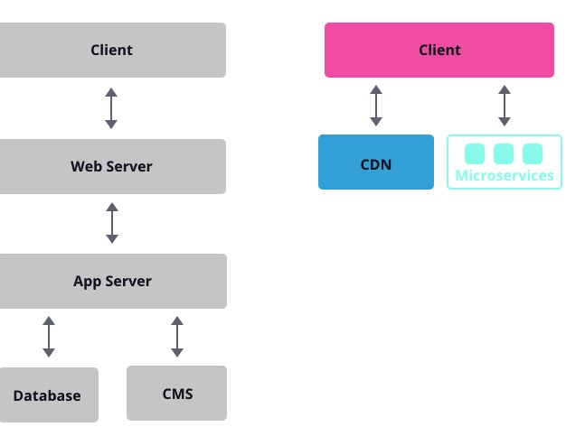

# JAMStack 简介及使用分享

前端摆脱后端数据库还能玩的转吗？今天介绍一下 JAMStack。([查看 Jamstack Conf 视频](https://www.youtube.com/channel/UC8bRyfU7ycLXnEBfvdorpUg))

## 什么是 [JAMStack](https://jamstack.org/)? 

> JAMStack 是基于客户端JavaScript，可重用API和预构建Markup的现代Web开发架构。——Netlify联合创始人Mathias Biilmann。

JAMStack（JAM 代表 **J**avaScript，**A**PI 和 **M**arkup）是一种使用 [Static Site Generators](https//www.staticgen.com/) (SSG) 技术、不依赖 Web Server 的前端架构,  依赖于模板标记可以通过一个请求的文件API，通过客户端的JavaScript渲染页面上的内容。

核心是：**不依赖 Web Server。**

JAMStack由于其性能更好的网站，低成本，高安全性，速度快，并且开发环境已经开始慢慢普及。

## 为什么选择JAMstack？

因为JAMstack的出现，我们无需关注操作系统，web服务器，数据库及后端开发方面的问题，网页纯静态生成，没有网络请求。

由于部署静态网站非常高效且访问速度极快，只需要给合适的CDN即可，因此非常适合博客，简历，产品组合，登录页面和文档。

JAMstack 的优点:

- 高性能：如果您想要完美的速度和性能构建网站，那么最好的选择就是使用JAMstack，通过CDN提供的部署上构建文件即可。
- 快速的部署：可以轻松部署 JAMstack 网站，而无需经历配置数据库，保护 `.htaccess` 等麻烦，只需处理静态文件，因此可以快速在CDN上部署运行。
- 超赞的开发体验：学习和使用JAMstack并不像想象中那么困难。只需HTML，CSS和JS经验，开发人员就可以构建复杂的网站，现在主流的三大框架都有对应的SSG方案，关键学习成本低。
- 高安全性：静态网站具有极低的漏洞，因为它只是通过CDN提供的HTML文件和外部API处理，这可以减少任何可能的风险或对网站的攻击。
- 极高的性价比：随便找台静态服务器即可部署，没有数据库，通常费用比较低廉。

JAMstack 的缺点:

- **本身缺乏动态验证功能的支持**：比如需要依托登录权限验证，电子商务中购物车缓存结算等（可以依赖第三方用户权鉴[auth0](https://auth0.com/),接口服务也可以使用谷歌[firebase](https://firebase.google.com/)）。
- **高度依赖第三方系统**：高度依赖第三方系统意味着如果这些系统崩溃，那么你的站点也会崩溃。

## 如何开始？

使用成熟可靠的静态站点生成器可以在几分钟内构建JAMstack网站和应用，推荐以下几款流行的，且模板选择较多。

### JAMstack 框架集合介绍

#### 基于React

- ✅ [Gatsby](https://www.gatsbyjs.com/)：一个基于React的免费开源框架，可以帮助开发人员构建超快速的网站和应用程序，用过之后会对浏览速度发出惊叹。

- ✅[Docusaurus](https://www.docusaurus.cn) 当前版本2.0 支持文档站点生成器、静态站点生成器

#### 基于VUE

- [vitepress](https://github.com/vuejs/vitepress) Vue 官方推出的 SSG 框架。

- [Gridsome](https://www.gridsome.cn/)：基于 Vue.js 构建的 Jamstack 框架，Gridsome 让开发人员可以轻松地构建静态生成的网站和应用程序。
- ✅[vuepress](https://www.vuepress.cn/) Vue 驱动的静态网站生成器。
- ✅[Nuxtjs](https://www.nuxtjs.cn/)  基于vue 支持 SSR 及 JAMStack。
- ✅[Nextjs](https://github.com/vercel/next.js) 提供静态站点托管

#### 基于Angular

[scully](https://scully.io/) 基于angular 静态站点生成器。

#### 其它

- ✅ Eleventy 一个基于node构建的静态站点生成器。

- ✅Hugo：使用go语言开发，最受欢迎的开源静态站点生成器之一，凭借其惊人的速度和灵活性，使用Hugo制作网站变得轻松和灵活。
- ✅Jekyll：一个最早、简单、可扩展的静态站点生成器，得到Github全面支持，可方便免费部署在Github。
- ✅[Hexo](https://hexo.io/zh-cn/): 同样是静态站点生成器，可方便免费部署在Github。
- [pelican](https://blog.getpelican.com/) 基于python 静态站点生成器。
- [MkDocs](https://www.mkdocs.org/)  一个用于创建项目文档的 快速, 简单的静态站点生成器。
- [Middleman](https://middlemanapp.com/) 是一个 Ruby 编写的静态网站生成器

### 对接JAMstack站点的CMS系统

- [forestry](app.forestry.io)
- [netlifycms](https://www.netlifycms.org/)
- [sanity](https://www.sanity.io/)

###站点部署

- [vercel](https://vercel.com/dashboard)
- [netlify](https://netlify.app/)
- GitHub

## JAMstack使用实践

无论使用哪种JAMstack框架，都限定了使用范围，对于由用户动态生成内容类的站点不适合使用JAMstack，比如微博，知乎等。

比较适合的类型

- 项目文档之类的网站，例如React的官网等
- 企业或者组织的官方网站
- 个人的博客网站
- 中小型企业电商等

总结：

JAMstack是一种新型制作网站方法，提供更好的性能，更高的安全性，更低的扩展成本以及更好的开发人员体验。