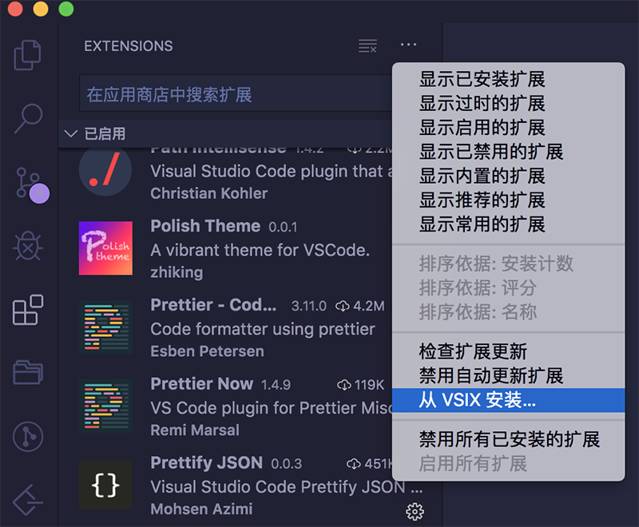

# 如何定制一个VSCode个性化主题

## 说明

本文更新于2019-11-30，使用VSCode 1.40.2，操作系统为 MacOS. 一直使用Atom作为主流开发工具，在Atom使用一款主题觉得不错，就尝试对应到了VScode，下面就对如何开发一个开发主题做个说明。

## 第一部分： 注册你的开发者帐号和配置 token

要开发插件，必不可少的工具就是 [vsce](https://github.com/Microsoft/vscode-vsce)，这个是官方管理插件的工具，所有插件都通过这个工具来发布。

首先全局安装 vsce :

```
npm install -g vsce
```

之后你需要去注册一个账号，网址在这：[Azure DevOps Services | Microsoft Azure](https://azure.microsoft.com/zh-cn/services/devops/),账号注册，此处不表。

- 登陆之后，首先新建一个 public 项目
- 点击右上角的头像之前的图标小人，下拉列表里选 Personal Access Tokens
- 为你的 token 指定一个名称，时间的话最长到期可以设置为一年
- 点击查看所有的配置项，找到 Marketplace 并选择 Acquire and Manage
- 点击 Create ，复制生成的 token，之后就要用到我们刚才安装的 vsce 来创建新的发布者

[个人 azure 访问空间地址](https://dev.azure.com/codeffer/)

```
vsce create-publisher (发布者的名字)
`
```

回车之后会依次提示输入name、email，和你刚刚复制的 token。

现在你可以通过下面这个命令来登陆:

```
vsce login (发布者的名字)
```

如果你遇到文中没有提到的问题，建议你看官方这两篇文章:

- [创建账号](https://docs.microsoft.com/zh-cn/azure/devops/organizations/accounts/create-organization?view=azure-devops)
- [发布扩展](https://code.visualstudio.com/api/working-with-extensions/publishing-extension)

发布扩展可以[在线上传](https://marketplace.visualstudio.com/manage/publishers/zhiking)扩展包

## 第二部分：用脚手架生成基本的插件代码

### 安装脚手架工具

```
npm install -g yo generator-code
```

然后运行下面的命令👇，它可以在任何目录中生成一套基本的插件代码：

```
yo code
```

选择 `New Color Theme` 之后一路配置。默认文件目录已经帮你创建好了。

打开你的主题根目录下的package.json，添加如下：

```
"publisher": "your publisher name",
```

最好同时设置repository：

```
"repository": {
    "type": "git",
    "url": "https://github.com/xxx/xxx"
},
```

### 本地安装你的扩展

这时候就可以测试本地打包 运行命令

```
vsce package
```

打包生成了`.vsix`文件



打开 VScode 点击左侧插件图标，在插件部分右上角点击 `...`, 在下拉列表里会有 从VSIX安装， 可以安装你已经打包📦好的文件。

### 上传到插件市场与他人共享

修改readme文件让别人了解你的扩展 运行命令

```
vsce publish
```

稍等几分钟别人就可以搜索到你的扩展了

你也可以打开 [Marketplace](https://marketplace.visualstudio.com/search?target=VSCode&category=Themes&sortBy=Installs)，通过网页上传已经本地打包的扩展。

### 更新你的扩展

```
vsce publish 1.0.1
```

> 你可以在vscode中搜索 [polish theme](https://marketplace.visualstudio.com/items?itemName=zhiking.polish-theme#review-details) 尝试使用我定义的主题。

## 第三部分：详解 VSCode 配色方案

> 主题配色参考 <https://vscodethemes.com/>

> 在线编辑配色主题 <http://tmtheme-editor.herokuapp.com/#!/editor/theme/Monokai>

> 在线定制配色主题 <https://themes.vscode.one/> 【这个比较👍🏻~】

在第二部分用脚手架生成基本的插件代码里打开目录,以我自定义主题为例

```
polish-theme/
    └── theme/
        │── polish.dark.json
        └── polish.light.json
    │── CHANGELOG.md
    ├── package.json
    ├── README.md
    └── LICENSE
```

### package.json文件

参数名                              |                                             作用
:------------------------------- | ---------------------------------------------:
name                             | 主题ID，必需在VSCode中全局唯一，即所有主题的package.json中该值均不能重复
contributes -> themes -> label   |                      主题名，"文件-首选项-颜色主题"的列表中显示该值
contributes -> themes -> uiTheme |                          VSCode整体的UI主题，vs为黑色主题
contributes -> themes -> path    |                       定义配色方案的文件名，如为相对路径则相对于此文件

### theme目录下json文件解释

VSCode使用其以下两个节点：

- colors：VSCode各个UI组件的颜色
- tokenColors：语法高亮颜色

### colors 部分内容字段解释

colors节点的内容直接通过键值对参数描述，以下列举几个参数的作用：

参数名                                 |                                  作用
:---------------------------------- | ----------------------------------:
activityBar.background              |                              活动栏背景色
activityBar.foreground              |                      活动栏前景色(例如用于图标)
editor.background                   |                             编辑器背景颜色
editor.foreground                   |                            编辑器默认前景色
editor.findMatchBackground          |                          当前搜索匹配项的颜色
editor.findMatchHighlightBackground |                          其他搜索匹配项的颜色
editor.lineHighlightBackground      |                      光标所在行高亮文本的背景颜色
editor.selectionBackground          |                          编辑器所选内容的颜色
editor.selectionHighlightBackground |                    与所选内容具有相同内容的区域颜色
editor.rangeHighlightBackground     | 突出显示范围的背景颜色，例如 "Quick Open" 和"查找"功能
editorBracketMatch.background       |                            匹配括号的背景色
editorCursor.foreground             |                             编辑器光标颜色
editorGutter.background             |             编辑器导航线的背景色，导航线包括边缘符号和行号
editorLineNumber.foreground         |                             编辑器行号颜色
sideBar.background                  |                              侧边栏背景色
sideBar.foreground                  |                              侧边栏前景色
sideBarSectionHeader.background     |                         侧边栏节标题的背景颜色
statusBar.background                |                            标准状态栏背景色
statusBar.noFolderBackground        |                     没有打开文件夹时状态栏的背景色
statusBar.debuggingBackground       |                        调试程序时状态栏的背景色
tab.activeBackground                |                           活动选项卡的背景色
tab.activeForeground                |                       活动组中活动选项卡的前景色
tab.inactiveBackground              |                          非活动选项卡的背景色
tab.inactiveForeground              |                      活动组中非活动选项卡的前景色
panel.border                        |                          命令行区域边框线颜色
editorGroup.border                  |                          多区域编辑边框线颜色

不限于以上自定义部分，读者可以自行查找。

### tokenColors 部分解释

tokenColors使用一个对象数组描述各语法高亮颜色。每个对象有如下结构：

```
{
    "name": "Comment",
    "scope": [
        "comment",
        "punctuation.definition.comment"
    ],
    "settings": {
        "background": "#ffffff",
        "fontStyle": "italic",
        "foreground": "#000000"
    }
}
```

参数名                   |                                     作用
:-------------------- | -------------------------------------:
name                  |                      规则描述，一段容易理解的描述性文字
scope                 | 作用域，指定使用那些VSCode内部对象，其含义参看Scope Naming
setting -> background |                                 背景色，可选
setting -> fontStyle  |                           字体，可选，为bold、 | italic、underline
setting -> foreground |                                 前景色，可选

以下列举配置文件中几个name所指定的参数的作用：

参数名         |   作用
:---------- | ---:
Character   |   字符
Class       |   类名
Comment     |   注释
Function    |  函数名
Keyword     |  关键字
Number      |   数值
Operator    |  运算符
Parameter   | 函数参数
Punctuation | 标点符号
String      |  字符串
Type        | 内置类型
Variable    |  变量名
