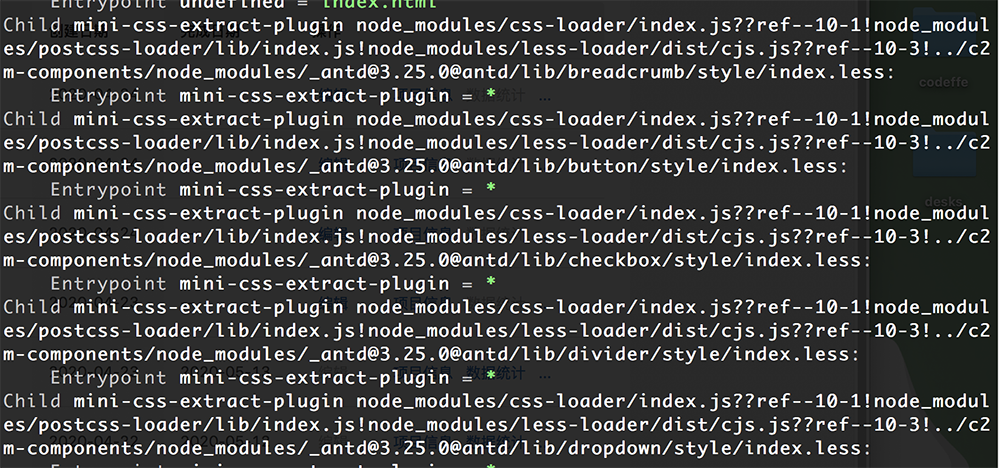

# Entrypoint mini-css-extract-plugin = *

webpack 打包过程中出现的问题：



找到的是 github [issues](https://github.com/webpack-contrib/mini-css-extract-plugin/issues/250) ,官方给出答复是在不同文件引入相同的两个css文件且顺序不同，就会导致警告。

找到可用答案

- 1.修改出现问题的js中css文件顺序 （我出现问题的css样式在三方引入库中，所以这种方式不行）

- 2.使用 `stats` 去掉 warning （推荐）  [stats官方文档 ](https://webpack.js.org/configuration/stats/#stats)

具体使用可直接写在：

```
module.exports={
  stats: 'errors-only',
}
```

如果有 `devServer` 在 `devServer` 里也加一份

## stats

| Preset      |    Alternative | Description  |
| :-------- | --------:| :--: |
| "errors-only"  | none |  只在发生错误时输出   |
| "minimal"     |   none |  只在发生错误或有新的编译时输出  |
| "none"      |   false | 没有输出  |
| "normal"      |    true | 标准输出  |
| "verbose"     |   none | 全部输出  |

