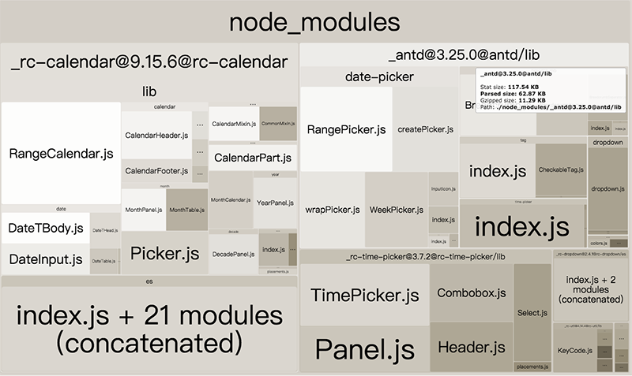

# ant3.x webpack打包被迫引进全部icons,如何按需引入？

在antd的4.x版本icon已经支持按需引入，但是一些项目中使用antd3.x版本的，在打包分析后，发现引入了全部的icons，
这样很不优雅，然后优化一番按需引入，下面就记录一下优化方法。

## 3.x官方导入方法

官方导入图标库的写法：

```
import * as allIcons from '@ant-design/icons/lib/dist';
```

源代码：[ant-design/ant-design](https://github.com/ant-design/ant-design/blob/4a41dd18489cf175c5db2d683b6bf7c615579d19/components/icon/index.tsx#L3)


打包文件太大的根源也就在此，所以我们只需要将 `@ant-design/icons/lib/dist` 重定向到我们自定义的文件即可。

- 第一步：安装Antd的图标库。Antd已经将 `@ant-design/icons` 作为依赖包安装过，我们只需将他添加到 `package.json`中，这样规范一点。 `npm install --save @ant-design/icons`。
- 第二步：创建文件 `utils/antdIcon.js`，导出你要使用的图标。

```
// antdIcon.js
export { default as RightOutline } from '@ant-design/icons/lib/outline/RightOutline';
export { default as FileSearchOutline } from '@ant-design/icons/lib/outline/FileSearchOutline';
export { default as ArrowRightOutline } from '@ant-design/icons/lib/outline/ArrowRightOutline';
export { default as CloseOutline } from '@ant-design/icons/lib/outline/CloseOutline';
export { default as InfoCircleOutline } from '@ant-design/icons/lib/outline/InfoCircleOutline';
export { default as SearchOutline } from '@ant-design/icons/lib/outline/SearchOutline';

export { default as CloseCircleFill } from '@ant-design/icons/lib/fill/CloseCircleFill';

// ...more
```

- 第三步：然后配置 webpack 的 `resolve.alias` 让解析引入包的地址时，变成解析成你配置的地址

```
resolve: {
    alias: {
      '@ant-design/icons/lib/dist$': path.resolve(__dirname, './src/utils/antdIcon.js') // antd 图标按需引入
    }
  },
```

配置之后我们在看打包后 `webpack-bundle-analyzer` 插件的输出




## 注意事项
- 配合官方的组件按需加载使用：[Antd 按需加载](https://link.zhihu.com/?target=https%3A//ant.design/docs/react/introduce-cn%23%25E6%258C%2589%25E9%259C%2580%25E5%258A%25A0%25E8%25BD%25BD)
- 配置 webpack 的 `resolve.alias` 时路径不要写错了
- antdIcons.js 引入icon的引入写法不能这么写
```
// antdIcons.js
export { CloseCircleFill } from '@ant-design/icons';
```

这种写法会使webpack4解析时不能进行 tree-shaking ，最后也会把整个 `@ant-design/icons` 打包进去

注意Antd的icon有 fill 和 outline 的区别，引入时注意检查
如果用到了Antd组件中也使用到了Icon组件，需要把这些组件需要用的Icon也一并导出。

----------

> 参考

> [官方关于这个问题的issues](https://github.com/ant-design/ant-design/issues/12011)

> [antd webpack后被迫引进全部icons，怎么优化？](https://www.zhihu.com/question/308898834)