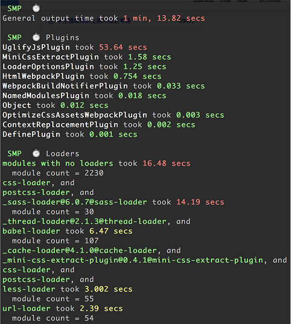
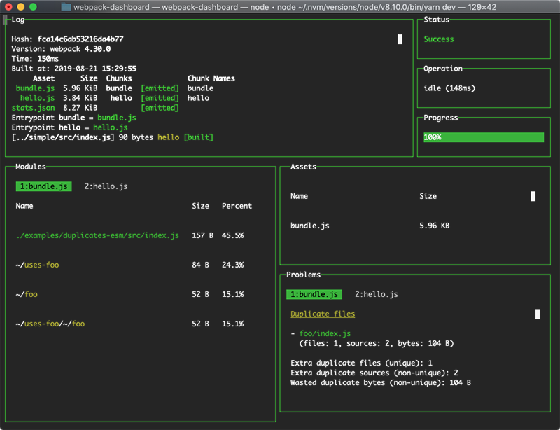
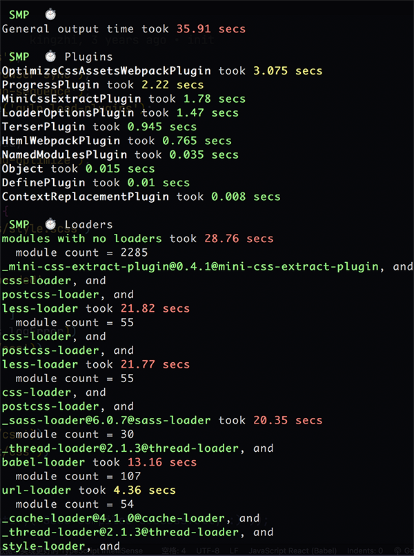

# webpack 打包加速指南

webpack打包缓慢费劲，搜罗一番，速度体积有了一定提升，在此分享记录一下。

首先搞明白究竟哪些流程影响了打包速度。

## 打包速度分析

它能够测量出在你的构建过程中，每一个 `Loader` 和 `Plugin` 的执行时长，运行的效果图是下面这样：



而它的使用方法也同样简单，如下方示例代码所示，只需要在你导出 Webpack 配置时，为你的原始配置包一层 
`smp.wrap` 就可以了，接下来执行构建，你就能在 console 面板看到如它 demo 所示的各类型的模块的执行时长。

```
const SpeedMeasurePlugin = require("speed-measure-webpack-plugin");
const smp = new SpeedMeasurePlugin();

module.exports = smp.wrap({
  ....
});
```
如上图所示，大部分的执行时长应该都是消耗在编译 JS、CSS 的 `Loader` 以及对这两类代码执行压缩操作的 `Plugin` 上。

## 优化方法

### 加入缓存机制

我们每次的项目变更，肯定不会把所有文件都重写一遍，但是每次执行构建却会把所有的文件都重复编译一遍，这样的重复工作是否可以被缓存下来呢，就像浏览器加载资源一样？答案肯定是可以的。

其实大部分 Loader 都提供了 cache 配置项，比如在 `babel-loader` 中，可以通过设置 `cacheDirectory` 来开启缓存，这样，`babel-loader` 就会将每次的编译结果写进硬盘文件（默认是在项目根目录下的node_modules/.cache/babel-loader目录内，当然你也可以自定义）。

```
{
    loader: 'babel-loader',
    options: {
      plugins: [],
      cacheDirectory: true
    }
  }
```

但如果 loader 不支持缓存呢？我们也有方法。接下来介绍一款神器：`[cache-loader](https://www.npmjs.com/package/cache-loader)` ，它所做的事情很简单，就是 `babel-loader` 开启 cache 后做的事情，将 loader 的编译结果写入硬盘缓存，再次构建如果文件没有发生变化则会直接拉取缓存。而使用它的方法很简单，正如官方 `demo` 所示，只需要把它卸载在代价高昂的 `loader` 的最前面即可：

```
module.exports = {
  module: {
    rules: [
      {
        test: /\.ext$/,
        use: ['cache-loader', ...loaders],
        include: path.resolve('src'),
      },
    ],
  },
};
```

同理，同样对于构建流程造成效率瓶颈的代码压缩阶段，也可以通过缓存解决大部分问题，以 `uglifyjs-webpack-plugin` 这款对于我们最常用的 Plugin 为例，它就提供了如下配置：

```
module.exports = {
  optimization: {
    minimizer: [
      new UglifyJsPlugin({
        cache: true,
        parallel: true,
      }),
    ],
  },
};
```

我们可以通过开启 `cache` 配置开启我们的缓存功能，也可以通过开启 `parallel` 开启多核编译功能。

### 多进程多实例构建，资源并行解析

多进程构建的方案比较知名的有以下三个：

- [thread-loader](https://www.npmjs.com/package/thread-loader) (推荐使用这个)
- parallel-webpack
- HappyPack
我使用了 `thread-loader` 为例配置多进程多实例构建

```
module: {
    rules: [
        {
            test: /\.js$/,
            use: ['thread-loader']
        }
    ]
}

```

### 多进程多实例并行压缩

并行压缩主流有以下三种方案

- 使用 parallel-uglify-plugin 插件
- uglifyjs-webpack-plugin 开启 parallel 参数
- [terser-webpack-plugin](https://www.npmjs.com/package/terser-webpack-plugin) 开启 parallel 参数 （推荐使用这个，支持 ES6 语法压缩）

使用方法也比较简单：如下

```
new TerserPlugin({
  cache: true,
  parallel: true,
  exclude: /\/node_modules/,
}),
```

### 提升打包体验

#### [progress-bar-webpack-plugin](https://www.npmjs.com/package/progress-bar-webpack-plugin)

这个插件可以展示构建进度，使用比较简单，就不具体展开，需要说一下的是，在webpack打包中加入 `--progress`

```
webpack --colors --progress
```
也有进度的展示。

#### [webpack-build-notifier](https://www.npmjs.com/package/webpack-build-notifier)

这个插件在你构建完成时，能够在通知栏弹出消息，提示你构建已经完成了。也就是说，当你启动构建时，就可以隐藏控制台面板，去做其他事情啦，构建完成后就会有通知，它的效果就是下面这样，同时还有提示音。


#### [webpack-dashboard](https://www.npmjs.com/package/webpack-dashboard)

这个插件在控制台将界面分区图形化 如图：



如果页面比较多，显示会有滚动条，而且内容比较堆叠，看个人喜好😯。

## 总结

综上所述，其实本质上，我们对与webpack构建效率的优化措施也就两个大方向：缓存和多核。

- 缓存是为了让二次构建时，不需要再去做重复的工作, 利用 `cache-loader` 
- 多核，更是充分利用了硬件本身的优势，让多核多线程一起工作。

所以你只要知道方向工具并利用好，那你就能做到更好的构建优化实践。

## 后记

通过一番如上操作，已经将当前开发项目的webpack构建从开始的1分13秒，提升至至35s左右，从构建流程上来看
剩余提升的地方主要就是处理样式部分了，压缩css的插件

- `mini-css-extract-plugin`
- `optimize-css-assets-webpack-plugin`



目前还没有缓存和多核方面更好的解决方便，费时比较长，可能需要从其他角度来优化。

