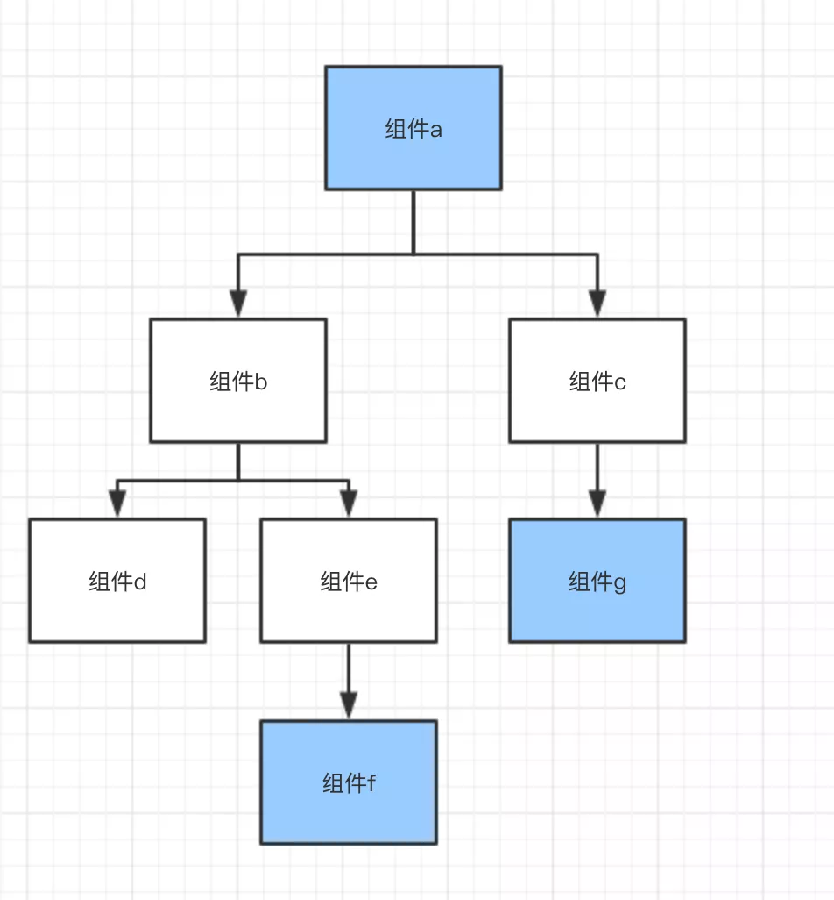
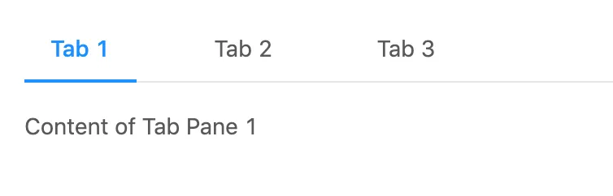

# React组件设计模式(下)

本文梳理了context模式、组合组件、组合与继承这三类React组件设计模式

上一篇介绍了三种设计模式，包括：

- 容器与展示组件；
- 高阶组件；
- render props。

这篇我们继续介绍三种设计模式，包括：

- context模式 ；
- 组合组件 ；
- 继承模式。

为了更好的理解，你可以将相应源码下载下来查看：https://github.com/imalextu/learn-react-patterns

## 一、Context模式

### 概念介绍

React 的 Context 接口提供了一个无需为每层组件手动添加 props ，就能在组件树间进行数据传递的方法。

在一个典型的 React 应用中，数据是通过 props 属性自上而下（由父及子）进行传递的，但这种做法对于某些类型的属性而言是极其繁琐的（例如：地区偏好，UI 主题），这些属性是应用程序中许多组件都需要的。Context 提供了一种在组件之间共享此类值的方式，而不必显式地通过组件树的逐层传递 props。

### 示例

React v16.3.0前后的Context相关API不同，这边只介绍新版本的Context使用方法。

第一步：新建createContext

首先，要用新提供的 createContext 函数创造一个“上下文”对象。

```
const ThemeContext = React.createContext();
```
第二步：生成Provider 和 Consumer

接着，我们用ThemeContext生成两个属性，分别是Provider和Consumer。从字面意思即可理解。Provider供数据提供者使用，Consumer供数据消费者使用。

```
const ThemeProvider = ThemeContext.Provider;
const ThemeConsumer = ThemeContext.Consumer;
```
第三步：使用ThemeProvider给数据提供者

```
const Context = () => {
  return (
    <div>
      <ThemeProvider value={{ mainColor: 'blue', textColor: 'pink' }} >
        <Page />
      </ThemeProvider>
    </div>
  )
}

// 调用context
const Page = () => (
  <div>
    <Title>标题</Title>
    <Content>
      内容
    </Content>
  </div>
);
```
第四步：使用ThemeConsumer给数据接收者

```
// 这里演示一个class组件。Counsumer使用了renderProps模式哦。
class Title extends React.Component {
  render() {
    return (
      <ThemeConsumer>
        {
          (theme) => (
            <h1 style={{ color: theme.mainColor }}>
              {this.props.children}
            </h1>
          )
        }
      </ThemeConsumer>
    );
  }
}

// 这里演示一个函数式组件
const Content = (props, context) => {
  return (
    <ThemeConsumer>
      {
        (theme) => (
          <p style={{ color: theme.textColor }}>
            {props.children}
          </p>
        )
      }
    </ThemeConsumer>
  );
};
```
### 模式所解决的问题

Context 主要应用场景在于很多不同层级的组件需要访问同样一些的数据。如下图，组件a、组件g、组件f需要共享数据，则只需要在最外层套上Provider，需要共享的组件使用Consumer即可

使用注意事项

因为 context 会使用参考标识（reference identity）来决定何时进行渲染，这里可能会有一些陷阱，当 provider 的父组件进行重渲染时，可能会在 consumers 组件中触发意外的渲染。举个例子，当每一次 Provider 重渲染时，以下的代码会重渲染所有下面的 consumers 组件，因为 value 属性总是被赋值为新的对象：



```
class App extends React.Component {
  render() {
    return (
      <Provider value={{something: 'something'}}>
        <Toolbar />
      </Provider>
    );
  }
}
```
为了防止这种情况，将 value 状态提升到父节点的 state 里：

```
class App extends React.Component {
  constructor(props) {
    super(props);
    this.state = {
      value: {something: 'something'},
    };
  }

  render() {
    return (
      <Provider value={this.state.value}>
        <Toolbar />
      </Provider>
    );
  }
}
```

## 二、组合组件

### 概念介绍

Compound Component 翻译为组合组件。借用组合组件，使用者只需要传递子组件，子组件所需要的props在父组件会封装好，引用子组件的时候就没必要传递所有props了。
组合组件核心的两个方法是React.Children.map和React.cloneElement。React.Children.map 用来遍历获得组件的子元素。React.cloneElement 则用来复制元素，这个函数第一个参数就是被复制的元素，第二个参数可以增加新产生元素的 props ，我们就是利用这个函数，把想要的 props 传入子元素。

### 示例

我们设计一个类似于 antd 中的 Tabs 组件，提供tab切换功能，而被选中的TabItem需要高亮。



如果我们使用常规写法，用 Tabs 中一个 state 记录当前被选中的 Tabitem 序号，然后根据这个 state 传递 props 给 TabItem，还需要传递一个 onClick 事件进去，捕获点击选择事件。

```
<TabItem active={true} onClick={this.onClick}>One</TabItem>
<TabItem active={false} onClick={this.onClick}>Two</TabItem>
<TabItem active={false} onClick={this.onClick}>Three</TabItem>
```

每次增加一个TabItem，是不是都需要传递active和onClick，这太繁琐了！我们用compound模式解决这个问题。
```
const TabItem = (props) => {
  const {active, onClick} = props;
  const tabStyle = {
    'max-width': '150px',
    color: active ? 'red' : 'green',
    border: active ? '1px red solid' : '0px',
  };
  return (
    <h1 style={tabStyle} onClick={onClick}>
      {props.children}
    </h1>
  );
};

// jsx调用Tabs以及TabItem
const Compound = (props, context) => {
  return (
    <Tabs>
      <TabItem>One</TabItem>
      <TabItem>Two</TabItem>
      <TabItem>Three</TabItem>
      <TabItem>Four</TabItem>
    </Tabs>
  );
};
```
上面的代码展示了我们最终调用Tabs以及TabItem的样子。重点在于Tabs我们要如何实现：

```
class Tabs extends React.Component {
  state = {
    activeIndex:  0
  }
  render() {
    const newChildren = React.Children.map(this.props.children, (child, index) => {
      if (child.type) {
        return React.cloneElement(child, {
          active: this.state.activeIndex === index,
          onClick: () => this.setState({activeIndex: index})
        });
      } else {
        return child;
      }
    });
    return (
      <Fragment>
        {newChildren}
      </Fragment>
    );
  }
}
```
原本我们要如此调用：

```
<TabItem active={false} onClick={this.onClick}>One</TabItem>
```
现在我们这样调用就可以了：

```
<TabItem>One</TabItem>
```

通过组合使用 React.Children.map 和 React.cloneElement，我们让TabItem获得了它想要的属性，简化了TabItem的使用，是不是很神奇？

### 模式所解决的问题

组合组件设计模式一般应用在一些共享组件上。如 select 和 option , Tab 和TabItem 等，通过组合组件，使用者只需要传递子组件，子组件所需要的 props 在父组件会封装好，引用子组件的时候就没必要传递所有 props 了。
我们可以在共享的组件中运用这种模式，简化组件使用者的调用方式，antd 当中你就能看到许多组合组件的使用。

## 三、继承模式

### 概念介绍

说了那么多的模式，我们最后来谈谈很熟悉的继承模式。如果组件定义为class组件，那么我们当然可以使用继承的模式来实现组件的复用。

### 示例

我们通过一个基类来实现一些通用的逻辑，然后再通过继承分别实现两个子类。

```
class Base extends React.PureComponent {
  getAlbumItem = () => {
    return null
  }
  render () {
    return (
      <div style={{border:'1px solid red',margin:5,width:300}}>
        {this.getAlbumItem()}
        <div>通用逻辑写这里</div>
      </div>
    )
  }
}
class Mobile extends Base {
  getAlbumItem = () => {
    return <span>mobile</span>
  }
}
class Pc extends Base {
  getAlbumItem = () => {
    return <span>pc</span>
  }
}
```

我们具体看下Provider组件是如何定义的。通过这段代码props.children(allProps),我们调用了传入的函数。

```
const Provider = (props) => {
  // 判断是否是女性用户
  let isWoman = Math.random() > 0.5 ? true : false
  if (isWoman) {
    const allProps = { add: '高阶组件增加的属性', ...props }
    return props.children(allProps)
  } else {
    return <div>女士专用，男士无权浏览</div>;
  }
}
```
我们可以看到Mobile和Pc共享了Base的逻辑，实现了复用。

### 组合与继承

如果你刚使用React，可能继承的方式对大家来说更熟悉的。因为继承看起来很方便，也很好理解。但是React官方并不推荐使用继承，因为各种组合的模式完全足够使用，上面的例子我们完全可以用组合的思想去实现。

为什么不推荐使用继承？继承有两个缺点，其一是，父类的属性和方法，子类是无条件继承的。也就是说，不管子类愿意不愿意，都必须继承父类所有的属性和方法，这样就不够灵活了。其二是，js中class并不直接支持多继承。这两个缺点使得继承相对于组合组件缺少了灵活性以及可扩展性。

请记住，组合优于继承！组件的复用请第一时间想到使用组合而非继承。

## 尾声

到这里，六种React组件设计模式就就讲完了。这六种模式已经覆盖了绝大多数的组件使用场景。随着React的更新，也许将来会有更多组件设计模式出现。但是思想都是想通的，比如“责任分离”、“不要重复自己”（DRY，Don't Repeat Yourself) 等等。明白这些代码设计思想，将来我们也能很快地掌握新的组件设计模式。


> 参考文档：
>
> [React官方文档](http://t.cn/AiYGz4Na)
>
> [React Component Patterns](http://t.cn/EvsJ8gj)
>
> [React实战：设计模式和最佳实践](http://t.cn/EUy09Ml)
>
> [Presentational and Container Components](http://t.cn/RqMyfwV)
>
> [React组件「设计模式」快速指南](http://t.cn/AiThDOqG)
>
> [为什么老鸟要告诉你优先使用组合而不是继承？](http://t.cn/AiThD8E4)
>
> 本文转自 [《你想知道的React组件设计模式这里都有(下)》](https://mp.weixin.qq.com/s/3mdP7ulz_mfDPTpUUFlBNA)
